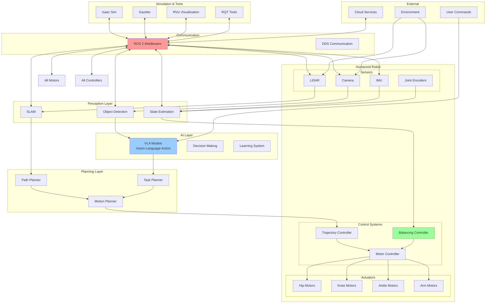

# Capstone Project

The capstone project integrates all concepts learned throughout this guide into a comprehensive humanoid robotics application. This project demonstrates the integration of perception, planning, control, and AI systems into a functional humanoid robot.

## System Architecture

The complete humanoid robotics system architecture includes:

- Perception layer (cameras, LiDAR, IMU)
- Planning layer (path planning, motion planning)
- Control layer (low-level motor control)
- Communication layer (ROS 2 middleware)
- AI layer (VLA models, decision making)

## Complete System Architecture



## Implementation Steps

### 1. System Integration Framework

```python
#!/usr/bin/env python3
"""
Complete Humanoid Robot System Integration
This script demonstrates the integration of all components
"""

import rclpy
from rclpy.node import Node
from sensor_msgs.msg import Image, LaserScan, Imu
from geometry_msgs.msg import Twist, PoseStamped
from std_msgs.msg import String
import numpy as np
import threading
import time

class HumanoidRobotSystem(Node):
    def __init__(self):
        super().__init__('humanoid_robot_system')

        # Initialize subsystems
        self.perception_system = PerceptionSystem(self)
        self.planning_system = PlanningSystem(self)
        self.control_system = ControlSystem(self)
        self.ai_system = AISystem(self)

        # System state
        self.current_pose = None
        self.current_velocity = None
        self.target_pose = None
        self.system_state = "IDLE"  # IDLE, NAVIGATING, MANIPULATING, etc.

        # Create timer for main control loop
        self.main_loop_timer = self.create_timer(0.05, self.main_control_loop)  # 20 Hz

        self.get_logger().info("Humanoid Robot System initialized")

    def main_control_loop(self):
        """Main control loop that integrates all subsystems"""
        try:
            # Get current state from perception
            current_state = self.perception_system.get_current_state()

            # Update AI system with current state
            ai_decision = self.ai_system.process_state(current_state)

            # Plan next action based on AI decision
            planned_action = self.planning_system.plan_action(
                current_state,
                ai_decision
            )

            # Execute planned action through control system
            control_commands = self.control_system.execute_action(planned_action)

            # Update system state
            self.system_state = ai_decision.get('state', 'IDLE')

            self.get_logger().debug(f"System state: {self.system_state}")

        except Exception as e:
            self.get_logger().error(f"Error in main control loop: {e}")

class PerceptionSystem:
    def __init__(self, node):
        self.node = node

        # Subscribe to sensor topics
        self.image_sub = node.create_subscription(
            Image, '/camera/rgb/image_raw', self.image_callback, 10)
        self.lidar_sub = node.create_subscription(
            LaserScan, '/scan', self.lidar_callback, 10)
        self.imu_sub = node.create_subscription(
            Imu, '/imu/data', self.imu_callback, 10)

        # Store latest sensor data
        self.latest_image = None
        self.latest_lidar = None
        self.latest_imu = None

        # SLAM and object detection systems
        self.slam_system = None  # Initialize SLAM system
        self.object_detector = None  # Initialize object detection system

    def image_callback(self, msg):
        self.latest_image = msg
        # Process image for object detection, etc.

    def lidar_callback(self, msg):
        self.latest_lidar = msg
        # Process LIDAR data for obstacle detection, mapping, etc.

    def imu_callback(self, msg):
        self.latest_imu = msg
        # Process IMU data for state estimation

    def get_current_state(self):
        """Return current state of the robot and environment"""
        state = {
            'image': self.latest_image,
            'lidar': self.latest_lidar,
            'imu': self.latest_imu,
            'map': self.slam_system.get_map() if self.slam_system else None,
            'objects': self.object_detector.detect_objects(self.latest_image) if self.object_detector else [],
            'position': self.get_position_estimate(),
            'velocity': self.get_velocity_estimate(),
            'orientation': self.get_orientation_estimate()
        }
        return state

    def get_position_estimate(self):
        # Implement position estimation from sensors
        return [0.0, 0.0, 0.0]  # x, y, z

    def get_velocity_estimate(self):
        # Implement velocity estimation
        return [0.0, 0.0, 0.0]  # vx, vy, vz

    def get_orientation_estimate(self):
        # Implement orientation estimation from IMU
        return [0.0, 0.0, 0.0, 1.0]  # qx, qy, qz, qw

class PlanningSystem:
    def __init__(self, node):
        self.node = node

        # Initialize planners
        self.path_planner = PathPlanner()
        self.motion_planner = MotionPlanner()
        self.task_planner = TaskPlanner()

    def plan_action(self, current_state, ai_decision):
        """Plan next action based on current state and AI decision"""
        action_type = ai_decision.get('action_type', 'idle')

        if action_type == 'navigate':
            # Plan navigation to target
            target = ai_decision.get('target', [0, 0, 0])
            path = self.path_planner.plan_path(current_state['position'], target)
            motion = self.motion_planner.plan_motion(path, current_state)
            return {'type': 'navigate', 'motion': motion}

        elif action_type == 'manipulate':
            # Plan manipulation action
            target_object = ai_decision.get('target_object')
            motion = self.motion_planner.plan_manipulation(target_object, current_state)
            return {'type': 'manipulate', 'motion': motion}

        else:
            # Default idle action
            return {'type': 'idle'}

class ControlSystem:
    def __init__(self, node):
        self.node = node

        # Publishers for control commands
        self.cmd_vel_pub = node.create_publisher(Twist, '/cmd_vel', 10)
        self.joint_cmd_pub = node.create_publisher(String, '/joint_commands', 10)

        # Initialize controllers
        self.trajectory_controller = TrajectoryController()
        self.balance_controller = BalanceController()

    def execute_action(self, planned_action):
        """Execute planned action and return control commands"""
        action_type = planned_action['type']

        if action_type == 'navigate':
            motion = planned_action['motion']
            cmd_vel = self.create_velocity_command(motion)
            self.cmd_vel_pub.publish(cmd_vel)
            return cmd_vel

        elif action_type == 'manipulate':
            motion = planned_action['motion']
            joint_cmd = self.create_joint_command(motion)
            self.joint_cmd_pub.publish(joint_cmd)
            return joint_cmd

        else:
            # Stop robot
            stop_cmd = Twist()
            self.cmd_vel_pub.publish(stop_cmd)
            return stop_cmd

    def create_velocity_command(self, motion):
        """Create velocity command from motion plan"""
        cmd = Twist()
        cmd.linear.x = motion.get('linear_x', 0.0)
        cmd.linear.y = motion.get('linear_y', 0.0)
        cmd.linear.z = motion.get('linear_z', 0.0)
        cmd.angular.x = motion.get('angular_x', 0.0)
        cmd.angular.y = motion.get('angular_y', 0.0)
        cmd.angular.z = motion.get('angular_z', 0.0)
        return cmd

    def create_joint_command(self, motion):
        """Create joint command from motion plan"""
        # Implementation depends on robot joint structure
        joint_cmd = String()
        joint_cmd.data = str(motion)  # Simplified representation
        return joint_cmd

class AISystem:
    def __init__(self, node):
        self.node = node

        # Subscribe to high-level commands
        self.command_sub = node.create_subscription(
            String, '/high_level_command', self.command_callback, 10)

        # Initialize VLA model
        self.vla_model = None  # Initialize VLA model
        self.current_command = None

    def command_callback(self, msg):
        """Process high-level command"""
        self.current_command = msg.data

    def process_state(self, current_state):
        """Process current state and return AI decision"""
        if self.current_command:
            # Use VLA model to interpret command in context of current state
            decision = self.interpret_command_with_vla(
                self.current_command,
                current_state
            )
            self.current_command = None  # Clear processed command
            return decision
        else:
            # Default behavior when no command is given
            return {'action_type': 'idle', 'state': 'IDLE'}

    def interpret_command_with_vla(self, command, state):
        """Use VLA model to interpret command in context of state"""
        # In a real implementation, this would use the VLA model
        # For now, return a simple interpretation
        if "go to" in command.lower() or "navigate to" in command.lower():
            # Extract target from command
            target = self.extract_target_from_command(command)
            return {
                'action_type': 'navigate',
                'target': target,
                'state': 'NAVIGATING'
            }
        elif "pick up" in command.lower() or "grasp" in command.lower():
            # Extract object from command
            target_object = self.extract_object_from_command(command)
            return {
                'action_type': 'manipulate',
                'target_object': target_object,
                'state': 'MANIPULATING'
            }
        else:
            return {'action_type': 'idle', 'state': 'IDLE'}

    def extract_target_from_command(self, command):
        """Extract target coordinates from command (simplified)"""
        # In a real implementation, this would use NLP to extract target
        return [1.0, 1.0, 0.0]  # Default target

    def extract_object_from_command(self, command):
        """Extract target object from command (simplified)"""
        # In a real implementation, this would use NLP to extract object
        return "object"  # Default object

def main():
    rclpy.init()
    robot_system = HumanoidRobotSystem()

    try:
        rclpy.spin(robot_system)
    except KeyboardInterrupt:
        robot_system.get_logger().info("Shutting down Humanoid Robot System")
    finally:
        robot_system.destroy_node()
        rclpy.shutdown()

if __name__ == '__main__':
    main()
```

### 2. Configuration Files

Create a launch file for the complete system:

```xml
<launch>
  <!-- Robot State Publisher -->
  <node pkg="robot_state_publisher" exec="robot_state_publisher" name="robot_state_publisher">
    <param name="robot_description" value="$(var robot_description)"/>
    <param name="publish_frequency" value="50.0"/>
  </node>

  <!-- Joint State Publisher -->
  <node pkg="joint_state_publisher" exec="joint_state_publisher" name="joint_state_publisher">
    <param name="rate" value="50"/>
  </node>

  <!-- Perception Stack -->
  <node pkg="rtabmap_ros" exec="rgbd_odometry" name="rgbd_odometry">
    <remap from="rgb/image" to="/camera/rgb/image_raw"/>
    <remap from="depth/image" to="/camera/depth/image_raw"/>
    <remap from="rgb/camera_info" to="/camera/rgb/camera_info"/>
    <param name="frame_id" value="base_link"/>
  </node>

  <node pkg="rtabmap_ros" exec="rtabmap" name="rtabmap">
    <param name="frame_id" value="base_link"/>
    <param name="subscribe_depth" value="true"/>
    <remap from="rgb/image" to="/camera/rgb/image_raw"/>
    <remap from="depth/image" to="/camera/depth/image_raw"/>
    <remap from="rgb/camera_info" to="/camera/rgb/camera_info"/>
  </node>

  <!-- Navigation Stack -->
  <include file="$(find-pkg-share nav2_bringup)/launch/navigation_launch.py">
    <arg name="use_sim_time" value="true"/>
  </include>

  <!-- Object Detection -->
  <node pkg="darknet_ros" exec="darknet_ros" name="darknet_ros">
    <param name="config_path" value="$(find-pkg-share darknet_ros)/config/yolov4.yaml"/>
  </node>

  <!-- Main System Node -->
  <node pkg="humanoid_robot" exec="humanoid_system.py" name="humanoid_robot_system" output="screen"/>

  <!-- Visualization -->
  <node pkg="rviz2" exec="rviz2" name="rviz2" args="-d $(find-pkg-share humanoid_robot)/rviz/humanoid_robot.rviz"/>
</launch>
```

### 3. Implementation Steps

1. **Integrate perception systems**
   - Camera, LiDAR, and IMU integration
   - SLAM for mapping and localization
   - Object detection and recognition

2. **Implement planning algorithms**
   - Path planning for navigation
   - Motion planning for manipulation
   - Task planning for high-level behaviors

3. **Connect control systems**
   - Trajectory control
   - Balance control for humanoid robots
   - Motor control interfaces

4. **Deploy AI models**
   - Vision-Language-Action models
   - Decision making systems
   - Learning capabilities

5. **Test and validate in simulation**
   - Isaac Sim for high-fidelity physics
   - Gazebo for basic simulation
   - Comprehensive testing scenarios

6. **Deploy to physical robot**
   - Hardware integration
   - Safety checks and validation
   - Real-world testing

## Testing and Validation

### Unit Tests

```python
import unittest
from humanoid_robot_system import HumanoidRobotSystem, PerceptionSystem, PlanningSystem

class TestHumanoidRobotSystem(unittest.TestCase):
    def setUp(self):
        # Setup test environment
        pass

    def test_perception_integration(self):
        """Test perception system integration"""
        # Test sensor data processing
        pass

    def test_planning_accuracy(self):
        """Test planning system accuracy"""
        # Test path planning, motion planning
        pass

    def test_control_stability(self):
        """Test control system stability"""
        # Test trajectory following, balance control
        pass

    def test_ai_decision_making(self):
        """Test AI system decision making"""
        # Test VLA interpretation, task planning
        pass

if __name__ == '__main__':
    unittest.main()
```

### Integration Tests

```bash
# Run integration tests in simulation
ros2 launch humanoid_robot simulation_tests.launch.py

# Test specific scenarios
ros2 run humanoid_robot test_navigation.py
ros2 run humanoid_robot test_manipulation.py
ros2 run humanoid_robot test_vla_integration.py
```

## Deployment Considerations

### Safety Protocols

1. **Emergency stop system**
2. **Collision avoidance**
3. **Physical limits enforcement**
4. **Human-robot interaction safety**

### Performance Optimization

1. **Real-time constraints**
2. **Resource utilization**
3. **Latency minimization**
4. **Energy efficiency**

### Maintenance and Updates

1. **Remote monitoring**
2. **Over-the-air updates**
3. **Performance logging**
4. **Diagnostics and debugging**