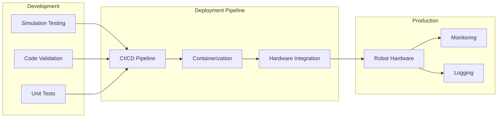

# Deployment

This section covers strategies for deploying humanoid robotics systems to production environments, including both simulation and physical hardware considerations.

## Deployment Strategies

### 1. Simulation Deployment
- Testing in controlled environments
- Performance validation
- Safety verification

### 2. Physical Robot Deployment
- Hardware integration
- Real-world testing
- Safety protocols

## Production Considerations

### Performance Optimization
- Real-time constraints
- Resource utilization
- Latency requirements

### Safety Protocols
- Emergency stops
- Collision avoidance
- Human-robot interaction safety

### Monitoring and Maintenance
- System health monitoring
- Performance metrics
- Remote diagnostics

## Deployment Architecture



## Containerization Example

For deploying robotics applications, containerization can help ensure consistent environments:

```dockerfile
FROM osrf/ros:humble-desktop-full

# Install dependencies
RUN apt-get update && apt-get install -y \
    python3-pip \
    git \
    && rm -rf /var/lib/apt/lists/*

# Copy workspace
COPY . /workspace
WORKDIR /workspace

# Install Python packages
RUN pip3 install -r requirements.txt

# Build ROS workspace
RUN source /opt/ros/humble/setup.bash && \
    colcon build

# Source workspace
RUN echo "source /workspace/install/setup.bash" >> ~/.bashrc

CMD ["bash", "-c", "source /opt/ros/humble/setup.bash && source /workspace/install/setup.bash && ros2 launch my_robot_bringup robot.launch.py"]
```

## Hardware Deployment Checklist

- [ ] Verify power requirements
- [ ] Check sensor calibration
- [ ] Validate communication links
- [ ] Test emergency procedures
- [ ] Confirm safety systems
- [ ] Document deployment process