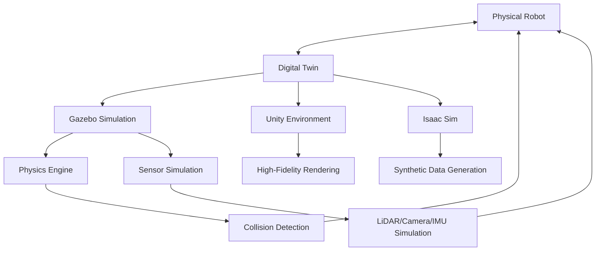

# Digital Twins for Humanoid Robotics

## Motivation

A digital twin is a virtual representation of a physical system that simulates its behavior in real-time. In humanoid robotics, digital twins are crucial for testing and validating robot behaviors before deployment on expensive hardware. They allow developers to iterate quickly, test dangerous scenarios safely, and validate control algorithms in a controlled environment.

## Core Concepts

### Simulation Environments
- **Gazebo**: Physics-based simulation with realistic dynamics and sensor simulation
- **Unity**: High-fidelity rendering and human-robot interaction scenes
- **Isaac Sim**: NVIDIA's simulation platform with synthetic data generation
- **Webots**: General-purpose robot simulation software

### Key Components
- **URDF (Unified Robot Description Format)**: Describes robot kinematics and dynamics
- **SDF (Simulation Description Format)**: Describes simulation worlds and objects
- **Physics Engines**: Handle collision detection and dynamic simulation
- **Sensor Simulation**: Simulates LiDAR, cameras, IMUs, and other sensors
- **ROS Integration**: Bridges simulation and real robot control systems

## Practical Examples

### URDF Model for Humanoid Robot

```xml
<?xml version="1.0"?>
<robot name="simple_humanoid">
  <!-- Base link -->
  <link name="base_link">
    <visual>
      <geometry>
        <box size="0.2 0.1 0.1"/>
      </geometry>
      <material name="blue">
        <color rgba="0 0 1 1"/>
      </material>
    </visual>
    <collision>
      <geometry>
        <box size="0.2 0.1 0.1"/>
      </geometry>
    </collision>
    <inertial>
      <mass value="1"/>
      <inertia ixx="1" ixy="0" ixz="0" iyy="1" iyz="0" izz="1"/>
    </inertial>
  </link>

  <!-- Head link -->
  <link name="head">
    <visual>
      <geometry>
        <sphere radius="0.05"/>
      </geometry>
      <material name="white">
        <color rgba="1 1 1 1"/>
      </material>
    </visual>
  </link>

  <!-- Joint connecting base to head -->
  <joint name="head_joint" type="revolute">
    <parent link="base_link"/>
    <child link="head"/>
    <origin xyz="0 0 0.15"/>
    <axis xyz="0 0 1"/>
    <limit lower="-1.57" upper="1.57" effort="100" velocity="1"/>
  </joint>
</robot>
```

### Gazebo World Configuration

```xml
<?xml version="1.0" ?>
<sdf version="1.6">
  <world name="simple_world">
    <include>
      <uri>model://sun</uri>
    </include>

    <include>
      <uri>model://ground_plane</uri>
    </include>

    <light name="sun" type="directional">
      <cast_shadows>true</cast_shadows>
      <pose>0 0 10 0 0 0</pose>
      <diffuse>0.8 0.8 0.8 1</diffuse>
      <specular>0.2 0.2 0.2 1</specular>
      <attenuation>
        <range>1000</range>
        <constant>0.9</constant>
        <linear>0.01</linear>
        <quadratic>0.001</quadratic>
      </attenuation>
      <direction>-0.6 0.4 -0.8</direction>
    </light>

    <model name="ground_plane">
      <static>true</static>
      <link name="link">
        <collision name="collision">
          <geometry>
            <plane>
              <normal>0 0 1</normal>
              <size>100 100</size>
            </plane>
          </geometry>
        </collision>
        <visual name="visual">
          <geometry>
            <plane>
              <normal>0 0 1</normal>
              <size>100 100</size>
            </plane>
          </geometry>
          <material>
            <ambient>0.3 0.3 0.3 1</ambient>
            <diffuse>0.5 0.5 0.5 1</diffuse>
            <specular>0.8 0.8 0.8 1</specular>
          </material>
        </visual>
      </link>
    </model>
  </world>
</sdf>
```

## Code Blocks

### ROS-Gazebo Integration Example

```python
import rclpy
from rclpy.node import Node
from geometry_msgs.msg import Twist
from sensor_msgs.msg import LaserScan
import math

class GazeboRobotController(Node):
    def __init__(self):
        super().__init__('gazebo_robot_controller')

        # Publisher for robot velocity commands
        self.cmd_vel_pub = self.create_publisher(Twist, '/cmd_vel', 10)

        # Subscriber for laser scan data
        self.scan_sub = self.create_subscription(
            LaserScan, '/scan', self.scan_callback, 10)

        # Timer for control loop
        self.timer = self.create_timer(0.1, self.control_loop)

        self.scan_data = None
        self.obstacle_detected = False

    def scan_callback(self, msg):
        self.scan_data = msg
        # Check for obstacles in front of the robot
        if self.scan_data:
            front_scan = self.scan_data.ranges[0]  # Front reading
            if front_scan < 1.0:  # Obstacle within 1 meter
                self.obstacle_detected = True
            else:
                self.obstacle_detected = False

    def control_loop(self):
        cmd = Twist()

        if self.obstacle_detected:
            # Stop and rotate to avoid obstacle
            cmd.linear.x = 0.0
            cmd.angular.z = 0.5
        else:
            # Move forward
            cmd.linear.x = 0.5
            cmd.angular.z = 0.0

        self.cmd_vel_pub.publish(cmd)

def main():
    rclpy.init()
    controller = GazeboRobotController()
    rclpy.spin(controller)
    controller.destroy_node()
    rclpy.shutdown()
```

### Simulation Architecture Visualization



## Troubleshooting

Common issues in digital twin development:
- **Physics accuracy**: Simulation may not match real-world dynamics
- **Sensor fidelity**: Simulated sensors may not perfectly match real sensors
- **Timing differences**: Simulation time vs real-time execution
- **Model complexity**: Complex models may cause performance issues
- **Integration problems**: Communication issues between ROS and simulation

## Quiz

1. What is the purpose of a digital twin in humanoid robotics?
2. What are the key differences between Gazebo, Unity, and Isaac Sim?
3. Why is URDF important for robot simulation?
4. What are the advantages of testing in simulation before real-world deployment?

## Next Steps

Continue to the [NVIDIA Isaac](../isaac/) section to learn about Isaac Sim and perception modules for humanoid robots.