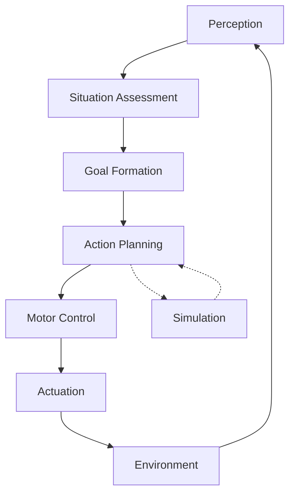

# Robotics Foundations

## Motivation

Understanding the foundational concepts of robotics is essential for developing humanoid robots. This section covers the mathematical, control, and sensor foundations that enable sophisticated humanoid behavior. These concepts form the backbone of all advanced robotics applications.

## Core Concepts

### Kinematics and Dynamics
- Kinematics: Motion description without considering forces
- Dynamics: Motion description with forces and torques
- Forward and inverse kinematics for controlling robot limbs
- Jacobian matrices for relating joint velocities to end-effector velocities

### Control Theory
- Feedback control systems
- Stability analysis
- Trajectory planning
- Adaptive control for changing environments

### Sensor Fusion
- Combining data from multiple sensors
- Kalman filtering and particle filters
- State estimation
- Handling sensor noise and uncertainty

### Mathematical Foundations

#### Linear Algebra in Robotics

Linear algebra is essential for representing positions, orientations, and transformations in 3D space:

```python
import numpy as np

# Homogeneous transformation matrix
def create_transform(translation, rotation_matrix):
    """Create a 4x4 homogeneous transformation matrix"""
    transform = np.eye(4)
    transform[0:3, 0:3] = rotation_matrix
    transform[0:3, 3] = translation
    return transform

# Example: Translation of (1, 2, 3) with no rotation
T = create_transform([1, 2, 3], np.eye(3))
print(T)
```

#### Kinematics

Kinematics describes the motion of systems without considering the forces that cause the motion:

```python
# Forward kinematics example for a simple 2-DOF arm
def forward_kinematics(theta1, theta2, l1, l2):
    """Calculate end-effector position given joint angles"""
    x = l1 * np.cos(theta1) + l2 * np.cos(theta1 + theta2)
    y = l1 * np.sin(theta1) + l2 * np.sin(theta1 + theta2)
    return x, y

# Inverse kinematics example
def inverse_kinematics(x, y, l1, l2):
    """Calculate joint angles given end-effector position"""
    # Calculate distance from origin to target
    r = np.sqrt(x**2 + y**2)

    # Check if target is reachable
    if r > l1 + l2:
        raise ValueError("Target is out of reach")

    # Calculate joint angles
    cos_theta2 = (r**2 - l1**2 - l2**2) / (2 * l1 * l2)
    theta2 = np.arccos(np.clip(cos_theta2, -1, 1))

    k1 = l1 + l2 * np.cos(theta2)
    k2 = l2 * np.sin(theta2)

    theta1 = np.arctan2(y, x) - np.arctan2(k2, k1)

    return theta1, theta2
```

## Practical Examples

### PID Control Implementation

Proportional-Integral-Derivative (PID) control is fundamental for robot control systems:

```python
class PIDController:
    def __init__(self, kp, ki, kd, dt=0.01):
        self.kp = kp
        self.ki = ki
        self.kd = kd
        self.dt = dt

        self.prev_error = 0
        self.integral = 0

    def update(self, setpoint, measured_value):
        error = setpoint - measured_value

        # Proportional term
        p_term = self.kp * error

        # Integral term
        self.integral += error * self.dt
        i_term = self.ki * self.integral

        # Derivative term
        derivative = (error - self.prev_error) / self.dt
        d_term = self.kd * derivative

        # Store current error for next iteration
        self.prev_error = error

        # Calculate output
        output = p_term + i_term + d_term
        return output
```

### Sensor Fusion with Kalman Filter

Sensor fusion combines data from multiple sensors to improve accuracy and reliability:

```python
import numpy as np

class KalmanFilter:
    def __init__(self, process_noise, measurement_noise, initial_state, initial_uncertainty):
        self.F = np.eye(len(initial_state))  # State transition model
        self.H = np.eye(len(initial_state))  # Observation model
        self.Q = np.eye(len(initial_state)) * process_noise  # Process noise
        self.R = np.eye(len(initial_state)) * measurement_noise  # Measurement noise
        self.P = np.eye(len(initial_state)) * initial_uncertainty  # Error covariance
        self.x = np.array(initial_state)  # State estimate

    def predict(self):
        # Predict step
        self.x = np.dot(self.F, self.x)
        self.P = np.dot(np.dot(self.F, self.P), self.F.T) + self.Q

    def update(self, measurement):
        # Update step
        y = measurement - np.dot(self.H, self.x)  # Innovation
        S = np.dot(np.dot(self.H, self.P), self.H.T) + self.R  # Innovation covariance
        K = np.dot(np.dot(self.P, self.H.T), np.linalg.inv(S))  # Kalman gain

        self.x = self.x + np.dot(K, y)
        self.P = np.dot((np.eye(len(self.P)) - np.dot(K, self.H)), self.P)
```

## Code Blocks

The control loop for a humanoid robot involves perception, planning, and action:



## Troubleshooting

Common issues in foundational robotics:
- Numerical instability in kinematic calculations
- Joint limits causing singularities
- Integration errors in control systems
- Sensor noise affecting state estimation

## Quiz

1. What are the three components of a PID controller?
2. What is the difference between forward and inverse kinematics?
3. Why is sensor fusion important in robotics?
4. How does embodied intelligence differ from traditional AI approaches?

## Next Steps

Continue to the [ROS 2](../ros2/) section to learn about the Robot Operating System, which provides the communication framework for humanoid robotics applications.