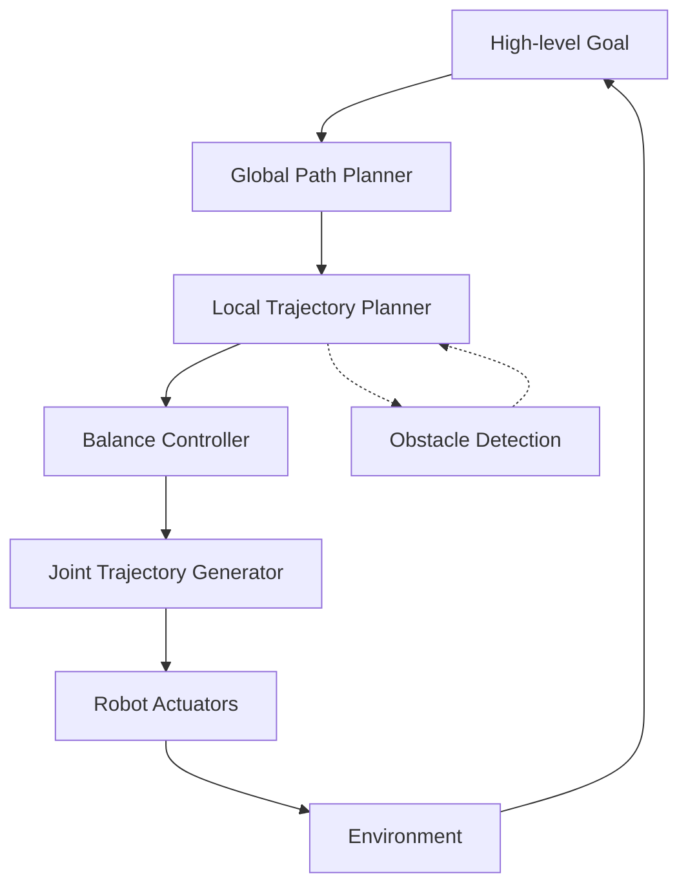

# Motion Planning

## Motivation

Motion planning is the process of determining a valid path for a robot to move from a start configuration to a goal configuration while avoiding obstacles. For humanoid robots, this becomes particularly complex due to their high degrees of freedom and the need for dynamic balance during movement.

## Core Concepts

### Path Planning Algorithms
- A* and Dijkstra's algorithm for optimal pathfinding
- RRT (Rapidly-exploring Random Trees) for high-dimensional spaces
- PRM (Probabilistic Roadmap) for complex environments
- Sampling-based vs. optimization-based approaches

### Trajectory Optimization
- Smooth trajectory generation
- Dynamic constraints for humanoid robots
- Time-optimal vs. energy-optimal trajectories
- Real-time replanning capabilities

### Humanoid Locomotion
- Walking pattern generation
- Balance control during movement
- Footstep planning for complex terrain
- Gait adaptation to different surfaces

## Practical Examples

### A* Path Planning Implementation

```python
import heapq
import numpy as np

def a_star(grid, start, goal):
    """A* path planning algorithm for grid-based environments"""
    open_set = [(0, start)]
    came_from = {}
    g_score = {start: 0}
    f_score = {start: heuristic(start, goal)}

    while open_set:
        current = heapq.heappop(open_set)[1]

        if current == goal:
            return reconstruct_path(came_from, current)

        for neighbor in get_neighbors(current, grid):
            tentative_g_score = g_score[current] + distance(current, neighbor)

            if neighbor not in g_score or tentative_g_score < g_score[neighbor]:
                came_from[neighbor] = current
                g_score[neighbor] = tentative_g_score
                f_score[neighbor] = g_score[neighbor] + heuristic(neighbor, goal)
                heapq.heappush(open_set, (f_score[neighbor], neighbor))

    return None  # No path found

def heuristic(a, b):
    """Heuristic function for A* (Euclidean distance)"""
    return np.sqrt((a[0] - b[0])**2 + (a[1] - b[1])**2)
```

### Trajectory Generation for Humanoid

```python
import numpy as np
from scipy import interpolate

class TrajectoryGenerator:
    def __init__(self, dt=0.01):
        self.dt = dt

    def generate_swing_foot_trajectory(self, start_pos, goal_pos, height=0.1):
        """Generate a smooth trajectory for swinging foot during walking"""
        # Define intermediate points for foot trajectory
        mid_point = (start_pos + goal_pos) / 2
        mid_point[2] += height  # Lift foot at midpoint

        # Create time vector
        duration = np.linalg.norm(goal_pos - start_pos) / 0.5  # Assume 0.5 m/s
        t = np.arange(0, duration, self.dt)

        # Generate trajectory using polynomial interpolation
        control_points = np.array([start_pos, mid_point, goal_pos])
        t_control = np.array([0, duration/2, duration])

        # Interpolate each dimension separately
        x_interp = interpolate.interp1d(t_control, control_points[:, 0], kind='cubic')
        y_interp = interpolate.interp1d(t_control, control_points[:, 1], kind='cubic')
        z_interp = interpolate.interp1d(t_control, control_points[:, 2], kind='cubic')

        trajectory = np.column_stack([
            x_interp(t),
            y_interp(t),
            z_interp(t)
        ])

        return trajectory, t
```

## Code Blocks

### Humanoid Motion Planning Architecture



## Troubleshooting

Common issues in motion planning:
- Local minima in potential field methods
- High computational complexity in high-DOF systems
- Dynamic obstacle avoidance in real-time
- Balance maintenance during complex movements

## Quiz

1. What is the main advantage of RRT over A* in high-dimensional spaces?
2. How does trajectory optimization differ from path planning?
3. What are the key challenges in humanoid locomotion planning?

## Next Steps

Continue to [Reinforcement Learning](../reinforcement-learning/) to learn about AI techniques for improving robot behavior through learning.