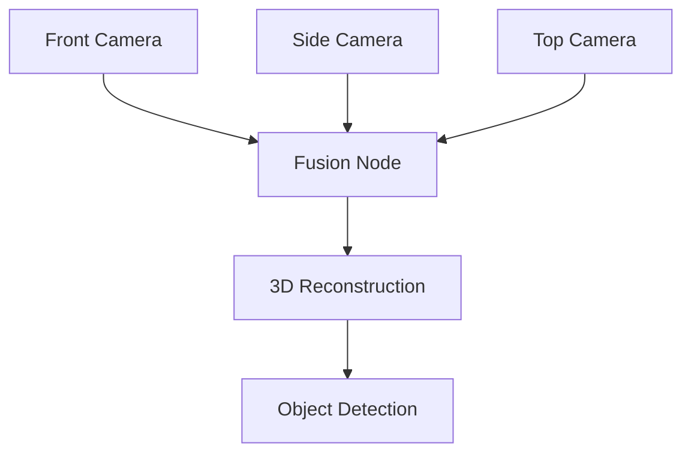

# Perception Systems

## Motivation

Perception systems are the eyes and ears of humanoid robots, enabling them to understand and interact with their environment. This module covers the essential concepts of computer vision, sensor fusion, and state estimation that allow humanoid robots to perceive the world around them.

## Core Concepts

### Computer Vision for Robotics
- Image processing and feature detection
- Object recognition and tracking
- Depth estimation and 3D reconstruction
- Visual SLAM for localization

### Sensor Fusion
- Combining data from multiple sensors (LiDAR, cameras, IMUs)
- Kalman filtering and particle filters
- Handling sensor noise and uncertainty
- Multi-modal perception

### State Estimation
- Robot pose estimation
- Environment mapping
- Dynamic object tracking
- Uncertainty quantification

## Practical Examples

### Image Processing Pipeline

```python
import cv2
import numpy as np

def detect_objects(image):
    """Detect objects in an image using computer vision techniques"""
    # Convert to grayscale
    gray = cv2.cvtColor(image, cv2.COLOR_BGR2GRAY)

    # Apply Gaussian blur to reduce noise
    blurred = cv2.GaussianBlur(gray, (5, 5), 0)

    # Detect edges using Canny edge detector
    edges = cv2.Canny(blurred, 50, 150)

    return edges

# Example usage
image = cv2.imread('robot_view.jpg')
edges = detect_objects(image)
```

### Sensor Fusion with Kalman Filter

```python
import numpy as np

class KalmanFilter:
    def __init__(self, process_noise, measurement_noise, initial_state, initial_uncertainty):
        self.F = np.eye(len(initial_state))  # State transition model
        self.H = np.eye(len(initial_state))  # Observation model
        self.Q = np.eye(len(initial_state)) * process_noise  # Process noise
        self.R = np.eye(len(initial_state)) * measurement_noise  # Measurement noise
        self.P = np.eye(len(initial_state)) * initial_uncertainty  # Error covariance
        self.x = np.array(initial_state)  # State estimate

    def predict(self):
        # Predict step
        self.x = np.dot(self.F, self.x)
        self.P = np.dot(np.dot(self.F, self.P), self.F.T) + self.Q

    def update(self, measurement):
        # Update step
        y = measurement - np.dot(self.H, self.x)  # Innovation
        S = np.dot(np.dot(self.H, self.P), self.H.T) + self.R  # Innovation covariance
        K = np.dot(np.dot(self.P, self.H.T), np.linalg.inv(S))  # Kalman gain

        self.x = self.x + np.dot(K, y)
        self.P = np.dot((np.eye(len(self.P)) - np.dot(K, self.H)), self.P)
```

## Code Blocks

### Multi-Camera Setup for 360° Perception



## Troubleshooting

Common issues in perception systems:
- Lighting conditions affecting computer vision
- Sensor calibration drift
- Data synchronization between multiple sensors
- Computational constraints in real-time processing

## Quiz

1. What are the three main components of a perception system?
2. How does sensor fusion improve robot perception?
3. What is the difference between visual SLAM and traditional SLAM?

## Next Steps

Continue to [Motion Planning](../motion-planning/) to learn about how humanoid robots plan their movements and navigate their environment.