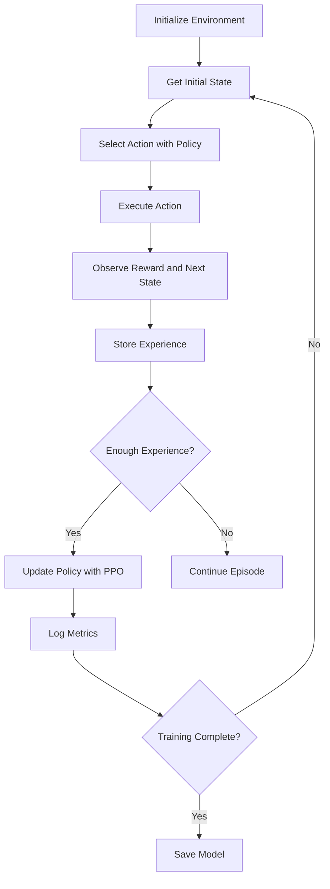

# Reinforcement Learning for Robotics

## Motivation

Reinforcement Learning (RL) provides a powerful framework for humanoid robots to learn complex behaviors through interaction with their environment. Unlike traditional control methods that require explicit programming, RL allows robots to discover optimal strategies through trial and error, making it particularly valuable for complex tasks where analytical solutions are difficult to obtain.

## Core Concepts

### Reinforcement Learning Fundamentals
- Markov Decision Processes (MDPs) and Partially Observable MDPs (POMDPs)
- Reward functions and value functions
- Exploration vs. exploitation trade-off
- Policy gradient methods and value-based methods

### Deep Reinforcement Learning
- Deep Q-Networks (DQN) for high-dimensional state spaces
- Actor-Critic methods for continuous control
- Proximal Policy Optimization (PPO) for stable learning
- Twin Delayed DDPG (TD3) for continuous action spaces

### Applications in Humanoid Robotics
- Locomotion control and gait learning
- Manipulation skill acquisition
- Adaptive behavior for dynamic environments
- Multi-agent coordination

## Practical Examples

### Q-Learning Implementation for Simple Navigation

```python
import numpy as np
import random

class QLearningAgent:
    def __init__(self, n_states, n_actions, learning_rate=0.1, discount=0.95, epsilon=1.0, epsilon_decay=0.995):
        self.n_states = n_states
        self.n_actions = n_actions
        self.lr = learning_rate
        self.gamma = discount
        self.epsilon = epsilon
        self.epsilon_decay = epsilon_decay

        # Initialize Q-table
        self.q_table = np.zeros((n_states, n_actions))

    def choose_action(self, state):
        """Choose action using epsilon-greedy policy"""
        if random.uniform(0, 1) < self.epsilon:
            # Explore: random action
            return random.randint(0, self.n_actions - 1)
        else:
            # Exploit: best known action
            return np.argmax(self.q_table[state, :])

    def learn(self, state, action, reward, next_state):
        """Update Q-table using Q-learning algorithm"""
        best_next_action = np.argmax(self.q_table[next_state, :])
        td_target = reward + self.gamma * self.q_table[next_state, best_next_action]
        td_error = td_target - self.q_table[state, action]
        self.q_table[state, action] += self.lr * td_error

    def decay_epsilon(self):
        """Decay exploration rate"""
        self.epsilon = max(0.01, self.epsilon * self.epsilon_decay)
```

### Actor-Critic for Continuous Control

```python
import torch
import torch.nn as nn
import torch.optim as optim
import numpy as np

class ActorCritic(nn.Module):
    def __init__(self, state_dim, action_dim, hidden_dim=256):
        super(ActorCritic, self).__init__()

        # Shared feature extractor
        self.feature_extractor = nn.Sequential(
            nn.Linear(state_dim, hidden_dim),
            nn.ReLU(),
            nn.Linear(hidden_dim, hidden_dim),
            nn.ReLU()
        )

        # Actor (policy network)
        self.actor_mean = nn.Linear(hidden_dim, action_dim)
        self.actor_std = nn.Linear(hidden_dim, action_dim)

        # Critic (value network)
        self.critic = nn.Linear(hidden_dim, 1)

    def forward(self, state):
        features = self.feature_extractor(state)

        # Actor
        action_mean = torch.tanh(self.actor_mean(features))
        action_std = torch.sigmoid(self.actor_std(features)) + 1e-5

        # Critic
        value = self.critic(features)

        return action_mean, action_std, value

class PPOAgent:
    def __init__(self, state_dim, action_dim, lr=3e-4, gamma=0.99, eps_clip=0.2):
        self.device = torch.device("cuda" if torch.cuda.is_available() else "cpu")
        self.actor_critic = ActorCritic(state_dim, action_dim).to(self.device)
        self.optimizer = optim.Adam(self.actor_critic.parameters(), lr=lr)
        self.gamma = gamma
        self.eps_clip = eps_clip

    def select_action(self, state):
        """Select action using the current policy"""
        state = torch.FloatTensor(state).unsqueeze(0).to(self.device)
        action_mean, action_std, value = self.actor_critic(state)

        # Sample action from normal distribution
        dist = torch.distributions.Normal(action_mean, action_std)
        action = dist.sample()

        return action.cpu().data.numpy()[0], value.cpu().data.numpy()[0]
```

## Code Blocks

### RL Training Loop for Humanoid Control



## Troubleshooting

Common issues in RL for robotics:
- Sparse reward problems
- Sample efficiency and long training times
- Sim-to-real transfer challenges
- Safety during exploration

## Quiz

1. What is the exploration-exploitation trade-off in RL?
2. How does Actor-Critic differ from value-based methods?
3. What are the main challenges in applying RL to physical robots?

## Next Steps

Continue to [Testing & Debugging](../testing-debugging/) to learn about ensuring robust and reliable robotic systems.