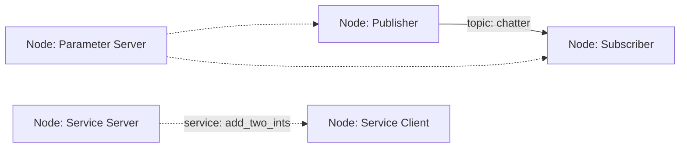

# ROS 2 - The Robotic Nervous System

## Motivation

ROS 2 (Robot Operating System 2) serves as the communication backbone for humanoid robotics applications. It provides a flexible framework for developing robot software by enabling distributed computation, standardized message passing, and modular architecture. Understanding ROS 2 is crucial for building complex humanoid robots that require coordination between multiple sensors, actuators, and control systems.

## Core Concepts

### Architecture Components
- **Nodes**: Individual processes that perform computation
- **Topics**: Named buses for publish/subscribe communication
- **Services**: Synchronous request/response communication
- **Actions**: Asynchronous request/goal/future communication for long-running tasks
- **Parameters**: Configuration values accessible across nodes
- **DDS (Data Distribution Service)**: Underlying communication middleware

### Communication Patterns
- **Publisher/Subscriber**: Asynchronous data streaming
- **Client/Server**: Synchronous request/response
- **Action Client/Server**: Asynchronous goal-oriented communication with feedback

## Practical Examples

### Basic rclpy Node Implementation

```python
import rclpy
from rclpy.node import Node
from std_msgs.msg import String

class MinimalPublisher(Node):

    def __init__(self):
        super().__init__('minimal_publisher')
        self.publisher_ = self.create_publisher(String, 'topic', 10)
        timer_period = 0.5  # seconds
        self.timer = self.create_timer(timer_period, self.timer_callback)
        self.i = 0

    def timer_callback(self):
        msg = String()
        msg.data = 'Hello World: %d' % self.i
        self.publisher_.publish(msg)
        self.get_logger().info('Publishing: "%s"' % msg.data)
        self.i += 1

def main(args=None):
    rclpy.init(args=args)

    minimal_publisher = MinimalPublisher()

    rclpy.spin(minimal_publisher)

    # Destroy the node explicitly
    minimal_publisher.destroy_node()
    rclpy.shutdown()

if __name__ == '__main__':
    main()
```

### Publisher/Subscriber Pattern

#### Publisher Node

```python
import rclpy
from rclpy.node import Node
from std_msgs.msg import String

class Publisher(Node):

    def __init__(self):
        super().__init__('publisher')
        self.publisher = self.create_publisher(String, 'chatter', 10)
        timer_period = 0.5
        self.timer = self.create_timer(timer_period, self.timer_callback)

    def timer_callback(self):
        msg = String()
        msg.data = 'Hello from publisher'
        self.publisher.publish(msg)
        self.get_logger().info('Publishing: "%s"' % msg.data)

def main():
    rclpy.init()
    publisher = Publisher()
    rclpy.spin(publisher)
    publisher.destroy_node()
    rclpy.shutdown()
```

#### Subscriber Node

```python
import rclpy
from rclpy.node import Node
from std_msgs.msg import String

class Subscriber(Node):

    def __init__(self):
        super().__init__('subscriber')
        self.subscription = self.create_subscription(
            String,
            'chatter',
            self.listener_callback,
            10)
        self.subscription  # prevent unused variable warning

    def listener_callback(self, msg):
        self.get_logger().info('I heard: "%s"' % msg.data)

def main():
    rclpy.init()
    subscriber = Subscriber()
    rclpy.spin(subscriber)
    subscriber.destroy_node()
    rclpy.shutdown()
```

## Code Blocks

### Services Implementation

#### Service Server

```python
import rclpy
from rclpy.node import Node
from example_interfaces.srv import AddTwoInts

class AddTwoIntsServer(Node):

    def __init__(self):
        super().__init__('add_two_ints_server')
        self.srv = self.create_service(AddTwoInts, 'add_two_ints', self.add_two_ints_callback)

    def add_two_ints_callback(self, request, response):
        response.sum = request.a + request.b
        self.get_logger().info('Incoming request\na: %d b: %d' % (request.a, request.b))
        return response

def main():
    rclpy.init()
    add_two_ints_server = AddTwoIntsServer()
    rclpy.spin(add_two_ints_server)
    add_two_ints_server.destroy_node()
    rclpy.shutdown()
```

#### Service Client

```python
import sys
import rclpy
from rclpy.node import Node
from example_interfaces.srv import AddTwoInts

class AddTwoIntsClient(Node):

    def __init__(self):
        super().__init__('add_two_ints_client')
        self.cli = self.create_client(AddTwoInts, 'add_two_ints')
        while not self.cli.wait_for_service(timeout_sec=1.0):
            self.get_logger().info('service not available, waiting again...')
        self.req = AddTwoInts.Request()

    def send_request(self, a, b):
        self.req.a = a
        self.req.b = b
        future = self.cli.call_async(self.req)
        rclpy.spin_until_future_complete(self, future)
        return future.result()

def main():
    rclpy.init()
    add_two_ints_client = AddTwoIntsClient()
    response = add_two_ints_client.send_request(int(sys.argv[1]), int(sys.argv[2]))
    add_two_ints_client.get_logger().info(
        'Result of add_two_ints: for %d + %d = %d' %
        (int(sys.argv[1]), int(sys.argv[2]), response.sum))
    add_two_ints_client.destroy_node()
    rclpy.shutdown()
```

### Actions for Long-Running Tasks

Actions are used for long-running tasks that may be canceled and provide feedback:

#### Action Server

```python
import rclpy
from rclpy.action import ActionServer
from rclpy.node import Node
from example_interfaces.action import Fibonacci

class FibonacciActionServer(Node):

    def __init__(self):
        super().__init__('fibonacci_action_server')
        self._action_server = ActionServer(
            self,
            Fibonacci,
            'fibonacci',
            self.execute_callback)

    def execute_callback(self, goal_handle):
        self.get_logger().info('Executing goal...')

        feedback_msg = Fibonacci.Feedback()
        feedback_msg.sequence = [0, 1]

        for i in range(1, goal_handle.request.order):
            if goal_handle.is_cancel_requested:
                goal_handle.canceled()
                self.get_logger().info('Goal canceled')
                return Fibonacci.Result()

            feedback_msg.sequence.append(
                feedback_msg.sequence[i] + feedback_msg.sequence[i-1])

            goal_handle.publish_feedback(feedback_msg)
            self.get_logger().info(f'Feedback: {feedback_msg.sequence}')

        goal_handle.succeed()
        result = Fibonacci.Result()
        result.sequence = feedback_msg.sequence
        self.get_logger().info(f'Result: {result.sequence}')
        return result

def main():
    rclpy.init()
    fibonacci_action_server = FibonacciActionServer()
    rclpy.spin(fibonacci_action_server)
    fibonacci_action_server.destroy_node()
    rclpy.shutdown()
```

### Parameters for Configuration

```python
import rclpy
from rclpy.node import Node

class ParameterNode(Node):

    def __init__(self):
        super().__init__('parameter_node')

        # Declare parameters with default values
        self.declare_parameter('robot_name', 'my_robot')
        self.declare_parameter('max_velocity', 1.0)
        self.declare_parameter('safety_mode', True)

        # Access parameter values
        robot_name = self.get_parameter('robot_name').value
        max_velocity = self.get_parameter('max_velocity').value
        safety_mode = self.get_parameter('safety_mode').value

        self.get_logger().info(f'Robot name: {robot_name}')
        self.get_logger().info(f'Max velocity: {max_velocity}')
        self.get_logger().info(f'Safety mode: {safety_mode}')

def main():
    rclpy.init()
    parameter_node = ParameterNode()
    rclpy.spin(parameter_node)
    parameter_node.destroy_node()
    rclpy.shutdown()
```

### Launch Files for System Deployment

Launch files allow you to start multiple nodes with a single command:

```python
from launch import LaunchDescription
from launch_ros.actions import Node

def generate_launch_description():
    return LaunchDescription([
        Node(
            package='demo_nodes_py',
            executable='listener',
            name='listener',
            parameters=[
                {'use_sim_time': True}
            ],
            remappings=[
                ('chatter', 'my_topic')
            ]
        ),
        Node(
            package='demo_nodes_py',
            executable='talker',
            name='talker',
            parameters=[
                {'use_sim_time': True}
            ]
        )
    ])
```

### ROS 2 System Architecture Visualization



## Troubleshooting

Common ROS 2 issues in humanoid robotics:
- **Network configuration**: DDS communication issues across different machines
- **Time synchronization**: Issues with simulation time vs real time
- **Resource management**: Memory leaks in long-running nodes
- **Message type compatibility**: Incompatible message definitions between nodes
- **Node lifecycle**: Proper initialization and cleanup of resources

## Quiz

1. What is the difference between a ROS 2 service and an action?
2. How does DDS enable communication in ROS 2?
3. When should you use parameters vs topics for configuration?
4. What are the advantages of using launch files in humanoid robotics systems?

## Next Steps

Continue to the [Digital Twin](../digital-twin/) section to learn about simulation environments that work with ROS 2 for testing humanoid robots.