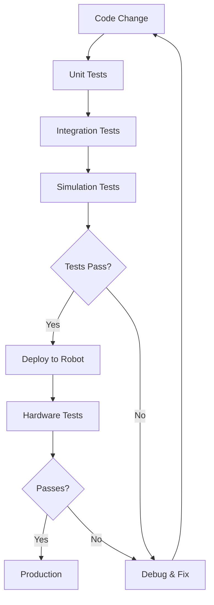

# Testing & Debugging Robotics Systems

## Motivation

Testing and debugging are critical for developing reliable and safe humanoid robots. Unlike traditional software systems, robotic systems operate in the physical world with real consequences for failures. This module covers specialized testing methodologies and debugging techniques tailored for complex robotic systems.

## Core Concepts

### Unit Testing for Robotics
- Testing individual robotic components and algorithms
- Mocking sensors and actuators for isolated testing
- Testing mathematical models and control algorithms
- Continuous integration for robotic code

### Integration Testing
- Testing interactions between multiple robotic subsystems
- End-to-end testing of complete robotic behaviors
- Hardware-in-the-loop (HIL) testing
- Multi-robot system testing

### Simulation-Based Testing
- Testing in physics-accurate simulation environments
- Testing with synthetic data and scenarios
- Regression testing with simulation
- Safety validation in simulation

### Hardware Debugging
- Safe debugging practices on physical robots
- Debugging tools and techniques for embedded systems
- Real-time debugging considerations
- Safety protocols during debugging

## Practical Examples

### Unit Testing for Control Algorithm

```python
import unittest
import numpy as np
from controller import PIDController

class TestPIDController(unittest.TestCase):
    def setUp(self):
        self.pid = PIDController(kp=1.0, ki=0.1, kd=0.01, dt=0.01)

    def test_initial_output(self):
        """Test that initial output is zero"""
        output = self.pid.update(setpoint=0, measured_value=0)
        self.assertEqual(output, 0)

    def test_proportional_response(self):
        """Test proportional response to error"""
        output = self.pid.update(setpoint=1.0, measured_value=0.0)
        expected = 1.0  # kp * error = 1.0 * 1.0
        self.assertAlmostEqual(output, expected, places=2)

    def test_integral_accumulation(self):
        """Test integral term accumulation"""
        # Apply consistent error over multiple updates
        for _ in range(10):
            self.pid.update(setpoint=1.0, measured_value=0.0)

        # Check that integral term has accumulated
        output = self.pid.update(setpoint=1.0, measured_value=0.0)
        self.assertGreater(abs(output), 1.0)  # Should be greater than proportional-only response

if __name__ == '__main__':
    unittest.main()
```

### Hardware Safety Wrapper

```python
import logging
from contextlib import contextmanager

class SafetyManager:
    def __init__(self):
        self.safety_limits = {
            'max_velocity': 1.0,  # rad/s
            'max_torque': 100.0,  # Nm
            'max_position_error': 0.1  # rad
        }
        self.is_emergency_stop = False
        self.logger = logging.getLogger(__name__)

    @contextmanager
    def safety_context(self):
        """Context manager for safe robot operations"""
        try:
            self.logger.info("Entering safe operation mode")
            yield self
        except Exception as e:
            self.logger.error(f"Emergency stop triggered: {e}")
            self.emergency_stop()
            raise
        finally:
            self.logger.info("Exiting safe operation mode")

    def validate_command(self, command):
        """Validate robot command against safety limits"""
        if abs(command.velocity) > self.safety_limits['max_velocity']:
            raise ValueError(f"Velocity command {command.velocity} exceeds limit {self.safety_limits['max_velocity']}")

        if abs(command.torque) > self.safety_limits['max_torque']:
            raise ValueError(f"Torque command {command.torque} exceeds limit {self.safety_limits['max_torque']}")

        return True

    def emergency_stop(self):
        """Emergency stop for safety"""
        self.is_emergency_stop = True
        # Send emergency stop command to robot
        self.logger.critical("Emergency stop activated!")
```

## Code Blocks

### Testing Pipeline Architecture



## Troubleshooting

Common debugging challenges in robotics:
- Non-deterministic behavior due to sensor noise
- Timing issues in real-time systems
- Hardware-specific problems
- Difficulties in reproducing intermittent failures

### Debugging Best Practices
1. Use logging extensively with timestamps
2. Implement state observers for monitoring
3. Create diagnostic tools for hardware
4. Use simulation to reproduce issues

## Quiz

1. What is the difference between unit testing and integration testing in robotics?
2. Why is simulation-based testing important for robotics?
3. What are the key considerations for debugging on physical robots?

## Next Steps

Continue to [VLA (Vision-Language-Action)]../vla/) to learn about advanced AI systems that combine perception, language, and action.