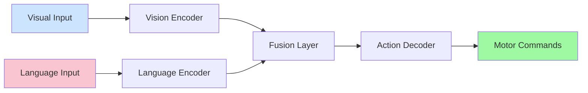

# VLA (Vision-Language-Action)

Vision-Language-Action (VLA) models represent a new paradigm in robotics where AI systems can understand visual input, process natural language instructions, and execute appropriate actions. These models enable robots to follow complex, natural language commands in real-world environments.

## VLA Pipeline

The VLA pipeline typically consists of:

1. **Vision Processing**: Understanding the visual environment
2. **Language Understanding**: Interpreting natural language commands
3. **Action Generation**: Producing appropriate motor commands

## VLA Pipeline Architecture



## VLA Implementation Example

```python
import torch
import torch.nn as nn
from transformers import CLIPVisionModel, CLIPTextModel, CLIPProcessor
import numpy as np

class VLAModel(nn.Module):
    def __init__(self, action_space_dim):
        super(VLAModel, self).__init__()

        # Vision encoder (using CLIP vision model)
        self.vision_encoder = CLIPVisionModel.from_pretrained("openai/clip-vit-base-patch32")

        # Text encoder (using CLIP text model)
        self.text_encoder = CLIPTextModel.from_pretrained("openai/clip-vit-base-patch32")

        # Fusion layer
        self.fusion_layer = nn.Linear(
            self.vision_encoder.config.hidden_size + self.text_encoder.config.hidden_size,
            512
        )

        # Action decoder
        self.action_decoder = nn.Sequential(
            nn.Linear(512, 256),
            nn.ReLU(),
            nn.Linear(256, 128),
            nn.ReLU(),
            nn.Linear(128, action_space_dim),
            nn.Tanh()  # Output actions in [-1, 1] range
        )

        self.dropout = nn.Dropout(0.1)

    def forward(self, pixel_values, input_ids, attention_mask):
        # Encode visual features
        vision_outputs = self.vision_encoder(pixel_values=pixel_values)
        vision_features = vision_outputs.pooler_output

        # Encode text features
        text_outputs = self.text_encoder(input_ids=input_ids, attention_mask=attention_mask)
        text_features = text_outputs.pooler_output

        # Concatenate vision and text features
        fused_features = torch.cat([vision_features, text_features], dim=-1)
        fused_features = self.dropout(fused_features)

        # Apply fusion layer
        fused_features = self.fusion_layer(fused_features)
        fused_features = torch.relu(fused_features)

        # Generate action
        actions = self.action_decoder(fused_features)

        return actions

# Example usage
def create_vla_pipeline():
    """Create a VLA pipeline for robot control"""
    from transformers import CLIPTokenizer

    # Initialize model
    model = VLAModel(action_space_dim=6)  # 6-DOF actions
    tokenizer = CLIPTokenizer.from_pretrained("openai/clip-vit-base-patch32")

    return model, tokenizer
```

## VLA Training Example

```python
import torch
import torch.nn.functional as F
from torch.utils.data import Dataset, DataLoader

class VLADataset(Dataset):
    def __init__(self, image_paths, texts, actions):
        self.image_paths = image_paths
        self.texts = texts
        self.actions = actions

    def __len__(self):
        return len(self.image_paths)

    def __getitem__(self, idx):
        # Load and preprocess image
        image = self.load_and_preprocess_image(self.image_paths[idx])

        # Tokenize text
        text = self.texts[idx]
        text_tokens = self.tokenize_text(text)

        # Get corresponding action
        action = self.actions[idx]

        return {
            'pixel_values': image,
            'input_ids': text_tokens['input_ids'],
            'attention_mask': text_tokens['attention_mask'],
            'actions': action
        }

    def load_and_preprocess_image(self, path):
        # Load and preprocess image
        from PIL import Image
        import torchvision.transforms as transforms

        image = Image.open(path).convert('RGB')
        preprocess = transforms.Compose([
            transforms.Resize((224, 224)),
            transforms.ToTensor(),
            transforms.Normalize(mean=[0.485, 0.456, 0.406],
                               std=[0.229, 0.224, 0.225])
        ])
        return preprocess(image)

    def tokenize_text(self, text):
        from transformers import CLIPTokenizer
        tokenizer = CLIPTokenizer.from_pretrained("openai/clip-vit-base-patch32")
        return tokenizer(text, padding=True, truncation=True, return_tensors="pt")

def train_vla_model(model, train_loader, num_epochs=10, lr=1e-4):
    """Train the VLA model"""
    optimizer = torch.optim.Adam(model.parameters(), lr=lr)

    model.train()
    for epoch in range(num_epochs):
        total_loss = 0
        for batch in train_loader:
            optimizer.zero_grad()

            # Forward pass
            predicted_actions = model(
                pixel_values=batch['pixel_values'],
                input_ids=batch['input_ids'].squeeze(1),
                attention_mask=batch['attention_mask'].squeeze(1)
            )

            # Compute loss (MSE for continuous actions)
            loss = F.mse_loss(predicted_actions, batch['actions'])

            # Backward pass
            loss.backward()
            optimizer.step()

            total_loss += loss.item()

        print(f"Epoch {epoch+1}/{num_epochs}, Loss: {total_loss/len(train_loader):.4f}")
```

## Whisper/LLM Pipeline Example

```python
import torch
import whisper
from transformers import AutoTokenizer, AutoModelForCausalLM
import numpy as np

class VLAPipeline:
    def __init__(self):
        # Load Whisper model for speech recognition
        self.speech_model = whisper.load_model("base")

        # Load LLM for language understanding
        self.tokenizer = AutoTokenizer.from_pretrained("microsoft/DialoGPT-medium")
        self.llm_model = AutoModelForCausalLM.from_pretrained("microsoft/DialoGPT-medium")

        # Define action space mapping
        self.action_mapping = {
            "move_forward": [0.5, 0.0, 0.0, 0.0, 0.0, 0.0],
            "turn_left": [0.0, 0.0, 0.0, 0.2, 0.0, 0.0],
            "turn_right": [0.0, 0.0, 0.0, -0.2, 0.0, 0.0],
            "pick_up": [0.0, 0.0, 0.0, 0.0, 0.0, 0.5],
            "place_down": [0.0, 0.0, 0.0, 0.0, 0.0, -0.5]
        }

    def process_speech_command(self, audio_path):
        # Transcribe speech to text
        result = self.speech_model.transcribe(audio_path)
        command_text = result["text"]
        print(f"Recognized command: {command_text}")

        # Process with LLM to generate action plan
        inputs = self.tokenizer.encode(command_text + self.tokenizer.eos_token, return_tensors="pt")
        outputs = self.llm_model.generate(inputs, max_length=1000, do_sample=True, pad_token_id=self.tokenizer.eos_token_id)
        response = self.tokenizer.decode(outputs[0], skip_special_tokens=True)

        # Extract action from response
        action = self.extract_action_from_response(response)
        return action, response

    def extract_action_from_response(self, response):
        # Simple keyword-based action extraction (in practice, use more sophisticated NLP)
        response_lower = response.lower()

        for action_name, action_vector in self.action_mapping.items():
            if action_name.replace("_", " ") in response_lower:
                return np.array(action_vector)

        # Default: no movement
        return np.array([0.0, 0.0, 0.0, 0.0, 0.0, 0.0])

# Example usage
vla = VLAPipeline()
# command_result = vla.process_speech_command("path/to/command.wav")
```

## Real-World VLA Integration

```python
import rclpy
from rclpy.node import Node
from sensor_msgs.msg import Image
from std_msgs.msg import String
from geometry_msgs.msg import Twist
from cv_bridge import CvBridge
import numpy as np

class VLAControlNode(Node):
    def __init__(self):
        super().__init__('vla_control_node')

        # Initialize VLA pipeline
        self.vla_pipeline = VLAPipeline()
        self.cv_bridge = CvBridge()

        # Store latest image
        self.latest_image = None

        # Create subscribers
        self.image_sub = self.create_subscription(
            Image,
            '/camera/rgb/image_raw',
            self.image_callback,
            10
        )

        self.command_sub = self.create_subscription(
            String,
            '/voice_command',
            self.command_callback,
            10
        )

        # Create publisher for robot commands
        self.cmd_vel_pub = self.create_publisher(Twist, '/cmd_vel', 10)

        # Timer for processing
        self.timer = self.create_timer(0.1, self.process_vla)

    def image_callback(self, msg):
        """Store latest camera image"""
        try:
            self.latest_image = self.cv_bridge.imgmsg_to_cv2(msg, "bgr8")
        except Exception as e:
            self.get_logger().error(f"Error converting image: {e}")

    def command_callback(self, msg):
        """Process voice command"""
        self.get_logger().info(f"Received command: {msg.data}")
        # Store command for processing in main loop
        self.current_command = msg.data

    def process_vla(self):
        """Process VLA pipeline"""
        if self.latest_image is not None and hasattr(self, 'current_command'):
            # In a real implementation, you would:
            # 1. Save the current image to a temporary file
            # 2. Process the command through the VLA pipeline
            # 3. Convert the output to robot commands

            # For now, simulate the process
            action_vector = np.array([0.2, 0.0, 0.0, 0.0, 0.0, 0.0])  # Move forward

            # Convert action vector to Twist message
            cmd_vel = Twist()
            cmd_vel.linear.x = float(action_vector[0])
            cmd_vel.linear.y = float(action_vector[1])
            cmd_vel.linear.z = float(action_vector[2])
            cmd_vel.angular.x = float(action_vector[3])
            cmd_vel.angular.y = float(action_vector[4])
            cmd_vel.angular.z = float(action_vector[5])

            # Publish command
            self.cmd_vel_pub.publish(cmd_vel)

            self.get_logger().info(f"Published command: {cmd_vel}")

            # Clear the command
            delattr(self, 'current_command')

def main():
    rclpy.init()
    vla_node = VLAControlNode()
    rclpy.spin(vla_node)
    vla_node.destroy_node()
    rclpy.shutdown()
```

## Architecture Overview

The VLA system connects perception, cognition, and action in a unified framework that enables robots to understand complex instructions and execute them in real-world environments.

## VLA Applications

1. **Household Robotics**: Following natural language commands for cleaning, organizing, etc.
2. **Industrial Automation**: Complex manipulation tasks guided by human instructions
3. **Assistive Robotics**: Helping people with disabilities based on voice commands
4. **Search and Rescue**: Following complex instructions in challenging environments
5. **Education**: Teaching robots new tasks through demonstration and language

## Challenges and Considerations

1. **Real-time Performance**: VLA models can be computationally expensive
2. **Safety**: Ensuring safe execution of interpreted commands
3. **Robustness**: Handling ambiguous or unclear commands
4. **Generalization**: Working in unseen environments
5. **Privacy**: Processing sensitive audio/visual data