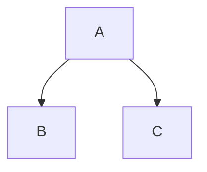

# Quickstart Guide: Humanoid Robotics Documentation

## Prerequisites

- Node.js version 18 or higher
- npm or yarn package manager
- Git

## Setup Instructions

1. **Clone the repository**
   ```bash
   git clone <repository-url>
   cd <repository-name>
   ```

2. **Install dependencies**
   ```bash
   npm install
   # or
   yarn install
   ```

3. **Start local development server**
   ```bash
   npm start
   # or
   yarn start
   ```

4. **Build for production**
   ```bash
   npm run build
   # or
   yarn build
   ```

## Documentation Structure

The documentation is organized into these main sections:

- **Introduction**: Overview of humanoid robotics
- **Foundations**: Core concepts and prerequisites
- **ROS 2**: Robot Operating System fundamentals
- **Digital Twin**: Simulation environments (Gazebo, Unity, Isaac)
- **Isaac**: NVIDIA Isaac robotics framework
- **VLA**: Vision-Language-Action systems
- **Capstone**: Complete project integration
- **Deployment**: Production deployment strategies
- **Appendices**: Additional resources and references

## Adding New Content

To add new documentation:

1. Create a new Markdown file in the appropriate `docs/` subdirectory
2. Add the file to the relevant section in `sidebars.js`
3. Use the frontmatter format if special configuration is needed:

```markdown
---
title: Title of the page
description: Description of the page
slug: /custom-url
---
```

## Code Examples

The documentation supports executable code examples. For Python/ROS examples, use:

```python
# Your Python code here
```

For system commands:

```bash
# Your command here
```

## Diagrams

Use Mermaid diagrams directly in Markdown:

